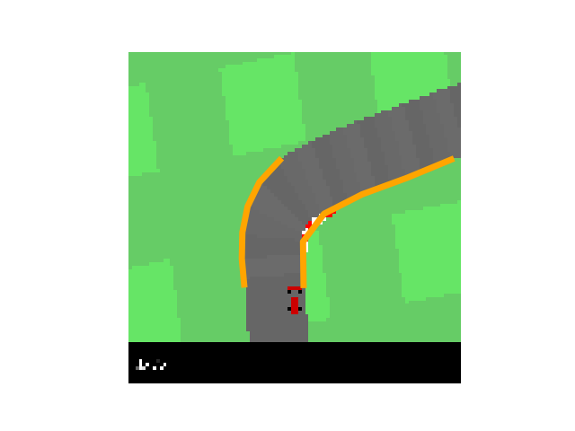
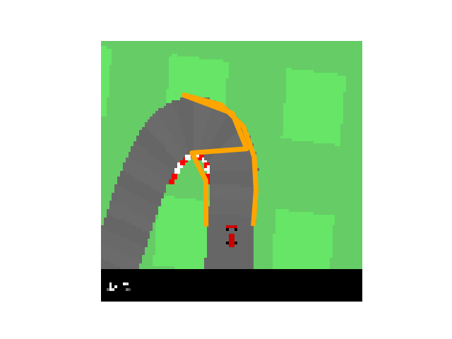
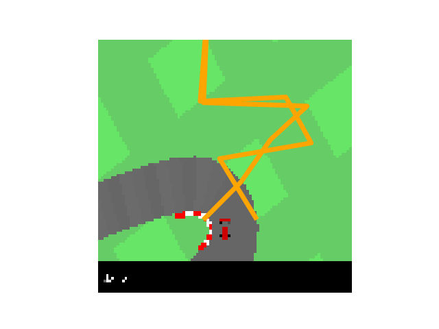
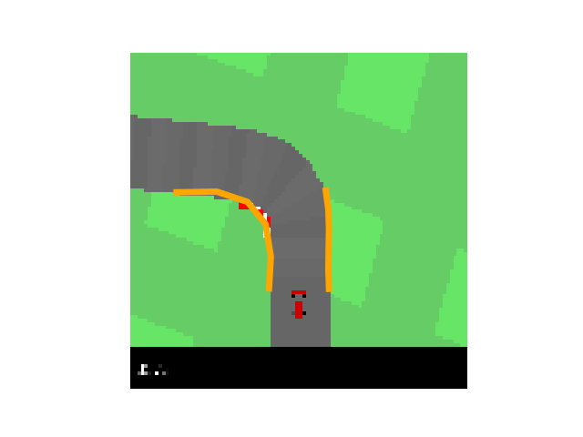
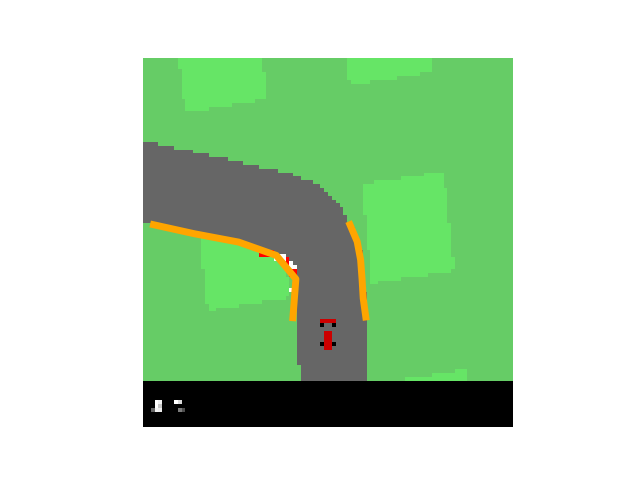
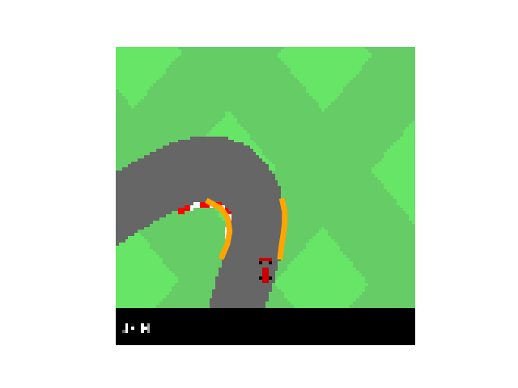
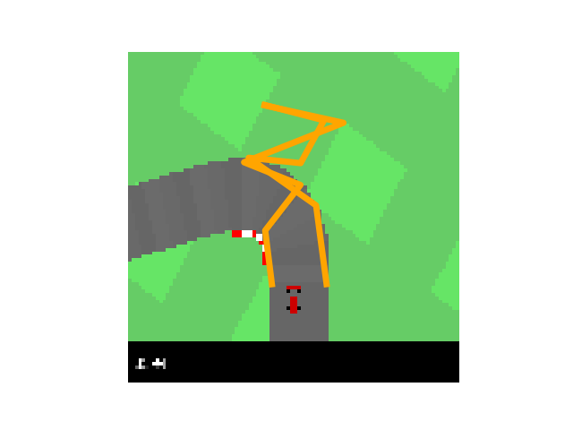
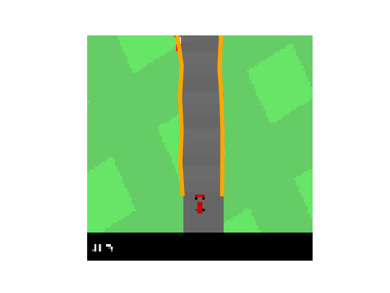
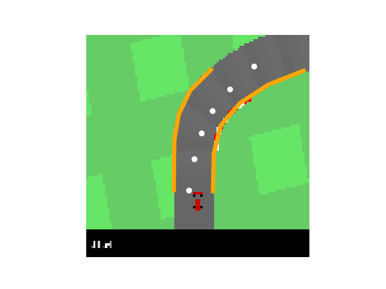
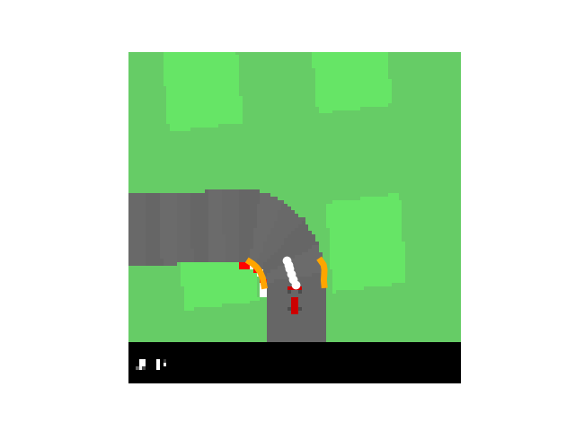

# Exercise 2 – Modular Pipeline
Submitted By: Shubham Arora

## 2.1 Lane Detection

### d) Testing
> Q. Find a good choice of parameters for the gradient threshold and the spline smoothness. If there are still some failure cases, describe them in the report and try to find reasons. 

Incresing the gradient threshold gives great improvement in performance. Especially during turns of around 90 degrees. This is mostly as increasing the threshold gets rid of the noise, less maximas, and hence it becomes easier to find nearest lane points.
We found gradient threshold = 25 to be a good fit.

Decreasing spline smoothness (to *5*) from the default value (*10*) does seem to give a worse lane spline, which gets worse in case of turns with a low gradient. Increasing the spline smoothness to *20* alongwith the `gradient_threshold=25` seems to give the best performance on harsh turns.

It also leads to better waypoints? So less contant steerng by the car? 

> Q. Add some state images including the lane boundaries to the report.

#### Case 1: Default `spline_smoothness=10`, `gradient_threshold=14`

 

#### Case 2: `spline_smoothness=10`, `gradient_threshold=25`

 

#### Case 3: `spline_smoothness=5`, `gradient_threshold=14`

 

## 2.2 Path planning

### a) Road center
> Q. Next determine the center between lane boundary points with the same spline parameter. Use the test waypoint prediction.py to verify your implementation. Add a plot to the report.

 

> Q. In which situations does the waypoint prediction fail? Why?

If the lane detection is not good (or smooth), the center values would not be good too.

### b) Path smoothing
> Q. Describe the purpose of the second term in the report. Then, implement the second term of the objective in the curvature() function.

The second expression in Eq is a curvature term; It minimizes the angle between two consecutive line segments in the base trajectory by minimizing the dot product of the segment vectors. Its function is to smooth the trajectory: The smaller the angle, the  smoother  the  trajectory.  The  scalar (B) trades off the quadratic  distance  between the waypoints and the lane centers with the curvature function.

### c) Target speed prediction

After implementing our complete pipeline, we realized that the target speed prediction at turns was an issue. So we changed the parameter K_v = 6.
This has the effect of better reducing the target speed at turns.

## 2.3 Lateral Control

### a) Stanley Controller Theory

> Q. Read section 9.2 of [2], understand the heuristic control law for the steering angle and explain the two parts of the control law*

> δ_SC (t) = ψ(t) + arctan (k ⋅ d(t)/v(t))

> where ψ(t) is the orientation error, v(t) is the vehicle speed, d(t) is the cross track error and k the gain parameter.

ψ(t) is the orientation error which is the angle between the vector to the closest waypoint and the vector representing the orientation of the vehicle. 
d(t) represents the lateral distance between the vehicle and the closest point on the trajectory.
v(t) represents the current speed of the vehicle.
k represents is the gain parameter. The second term adjusts the  steering  in nonlinear proportion  to  the  cross-track error d(t): The larger this error, the stronger the steering response toward the trajectory.

### b) Stanley controller

> Q. Implement the control law in the equation... and determine a reasonable gain parameter empirically. Describe the behavior of your car.

The Gain parameter K that we emperically determined to be the best is `k=1.8`. We infered that as the value of K is increased, the car tends to take sharper turns even for smaller values of cross-track errors.

### c) Damping
Q. Find a good choice for the damping parameter D and describe the impact of damping on the behavior of the car.

We need a damping parameter because at high speeds, there is a potential delay in stanley control loop that determines the control for the steering based on orientation and cross track errors. The damping parameter handles this time lag. We infered that the damping parameter and the gain parameters are somewhat corelated. The daming parameter helps the car stabalize after making a turn. 
For a gain parameter of `K = 2`, we use a damping factor of `D = 0.05`.

