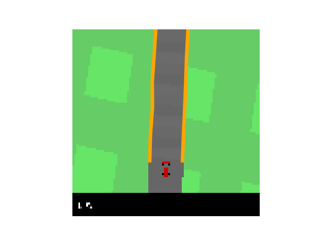

# Exercise 2 – Modular Pipeline
Submitted By: Shubham Arora

## 2.1 Lane Detection

### d) Testing
> Q. Find a good choice of parameters for the gradient threshold and the spline smoothness. If there are still some failure cases, describe them in the report and try to find reasons. 

Incresing the gradient threshold gives great improvement in performance. Especially during turns of around 90 degrees. This is mostly as increasing the threshold gets rid of the noise, less maximas, and hence it becomes easier to find nearest lane points.
We found gradient threshold = 25 to be a good fit.

Decreasing spline smoothness (to *5*) from the default value (*10*) does seem to give a worse lane spline, which gets worse in case of turns with a low gradient. Increasing the spline smoothness to *20* alongwith the `gradient_threshold=25` seems to give the best performance on harsh turns.

It also leads to better waypoints? So less contant steerng by the car? 

> Q. Add some state images including the lane boundaries to the report.

#### Case 1: Default `spline_smoothness=10`, `gradient_threshold=14`

 

#### Case 2: `spline_smoothness=10`, `gradient_threshold=25`

 

#### Case 3: `spline_smoothness=5`, `gradient_threshold=14`

 

## 2.2 Path planning

### a) Road center
> Q. Next determine the center between lane boundary points with the same spline parameter. Use the test waypoint prediction.py to verify your implementation. Add a plot to the report.

 

> Q. In which situations does the waypoint prediction fail? Why?

If the lane detection is not good (or smooth), the center values would not be good too.

### b) Path smoothing
> Q. Describe the purpose of the second term in the report. Then, implement the second term of the objective in the curvature() function.

TODO:

## 2.3 Lateral Control

### a) Stanley Controller Theory

> Q. Read section 9.2 of [2], understand the heuristic control law for the steering angle and explain the two parts of the control law*

> δ_SC (t) = ψ(t) + arctan (k ⋅ d(t)/v(t))

> where ψ(t) is the orientation error, v(t) is the vehicle speed, d(t) is the cross track error and k the gain parameter.

TODO: This equation

### b) Stanley controller

> Q. Implement the control law in the equation... and determine a reasonable gain parameter empirically. Describe the behavior of your car.

